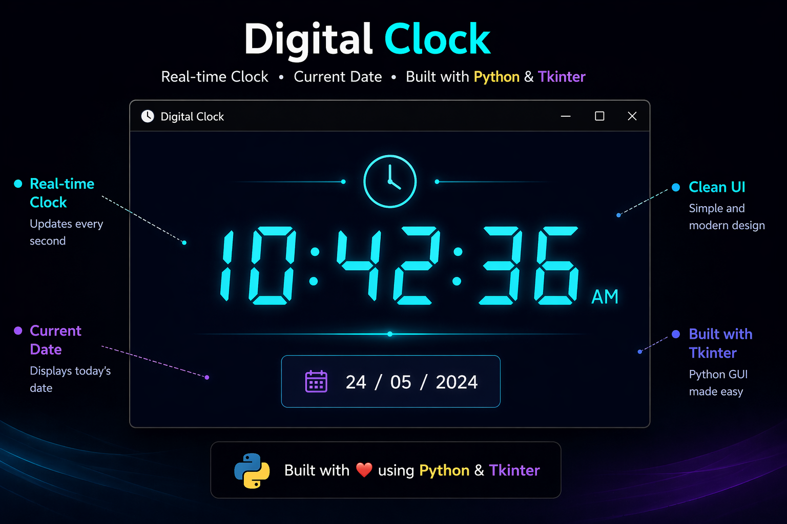

# ⏰ Digital Clock using Python



---

## 🚀 About Project
This is a modern Digital Clock application built using Python and Tkinter.  
It shows real-time time and date with a clean graphical interface.

---

## ✨ Features
- ⏱ Real-time clock (updates every second)
- 📅 Current date display
- 🎨 Simple and clean GUI
- ⚡ Lightweight application

---

## 🛠 Technologies Used
- Python
- Tkinter

---

## ▶️ How to Run

```bash
python clock.py

## 📸 Preview


